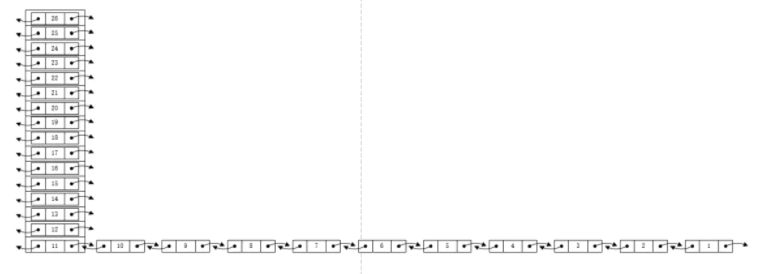
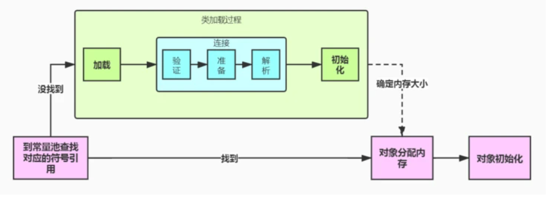

[TOC]

## 1 Typora快捷键

- ctr + k	页内引用
- ">" 引用

## 2 面试题

#### 2.1 汇总

##### 2.11 集合

1. hashmap的结构，默认扩容因子0.75时，达到12个元素后什么情况下不会引发扩容？最多能存储多少元素才引发扩容？

   [解析](#hashMap扩容)

2. 还是hashmap，和currenthashmap区别，二者结构，原理，hashmap能不能存null，为什么可以？

1. threadlocal原理，应用之类的；
2. hashMap hashTable区别
3. hashMap 1.7 和 1.8实现区别

##### 2.12 Mybatis

#### 2.2 面试题解析

##### hashMap扩容

jdk8:size大于threshold的时候扩容,12

jkd7:index0 11个全部hash冲突，后面15个index全部没有hash冲突，所以最多26个



## 3 算法

#### 3.1 时间复杂度

算法中的**基本操作的执行次数，为算法的时间复杂度**

时间复杂度和空间复杂度一般都使用大O的渐进表示法进行表示，大O的渐进表示法规则如下：

1、所有常数都用常数1表示。
2、只保留最高阶项。
3、如果最高阶项存在且不是1，则去除与这个项的系数，得到的结果就是大O阶

**在刷题时看到题目要求时间复杂度为O(1)，并不是要求函数内部不能含有循环，而是要求循环的次数为常数次。**

#### 3.2 空间复杂度

空间复杂度算的是变量的个数。

注：递归算法的空间复杂度通常是递归的深度（即递归多少层）

#### 3.3 重点算法

## 4 WEB开发

#### 4.1 Servlet

##### 4.1.1 常见面试题

Servlet的生命周期

```java
// 1.加载和实例化

// 2.初始化
// 3.请求处理
// 4.服务终止
```

1.servletContext生命周期跟web容器生命周期是保持一致的

#### 4.2 Mybatis

##### 4.2.1 原理


##### 4.2.2 配置的重点问题

1、如果引用的时mybatis-spring-boot-starter包，MyBatis-Spring-Boot-Starter会做以下操作：

- 自动检测到一个存在的数据源

- 创建并注册一个SqlSessionFactory对象，并将这个数据源传入SqlSessionFactory对象

- 将创建并注册SqlSessionTemplate的实例从SqlSessionFactory中获取的

- Auto-scan your mappers, link them to the `SqlSessionTemplate` and register them to Spring context so they can be injected into your beans

  > ```shell
  > 注意：以上有个前提，是你的Mapper接口跟你的Mapper.xml文件在同一个目录下，如果接口文件和xml是分开放置，比如xml文件在resource目录下，则需要手动配置SqlSessionFactory，并设定好xml扫描路径，此时yml文件中的mybatis.mapper-locations将不会起作用
  > ```

- 手动注入SqlSessionFactoryBean示例

  ```java
      @Bean
      public SqlSessionFactoryBean sqlSessionFactory () throws IOException {
          SqlSessionFactoryBean sqlSessionFactory = new SqlSessionFactoryBean();
          sqlSessionFactory.setDataSource(dataSource);
          /**
           * 如果自定义了SqlSessionFactoryBean，那么配置文件中的mybatis:mapper-locations将不会起作用，需要在此set
           */
          sqlSessionFactory.setMapperLocations(new PathMatchingResourcePatternResolver().getResources(mapperLocations));
          return sqlSessionFactory;
      }
  ```

- mapper.xml文件中jdbcType中必须是大写，无语

  ```xml
  <resultMap id="BasicResultMap" type="cn.qz.mybatis.entity.UserInfoEntity">
      <id column="id" jdbcType="INTEGER" property="id" />
      <result column="name"  jdbcType="VARCHAR" property="name" />
  ```

  

#### 4.3 事务

##### 4.3.1 概念


## 5 核心知识卷一

##### 5.1 常用命令

生成doc文档

javadoc -d tartgetDir package1  package2

##### 5.2 修饰符

public

> - 公用属性，其他类都可以调用

private

> - 私有属性，是最严格的，只有当前类可以调用，继承的子类也不可访问

protected

> - 解决private子类不能访问的缺陷，子类可以访问，相同包内也可以访问
> - 一个类的方法操作另一个类的对象，我们就说这个类依赖另一个类
> - 

final

> - 此变量只能被赋值一次
> - 命名字母全大写

##### 5.3 集合

**HashSet**

特性：

- 不保证元素顺序
- 允许为null
- 线程不安全
- 不允许有重复元素
- 底层实现是HashMap,因此也是线程不安全

构造函数

```java
//构造一个新的空集合; 背景HashMap实例具有默认初始容量（16）和负载因子（0.75）
    public HashSet() {
        map = new HashMap<>();
    }
```

**HashTable**

特性：

- 线程安全,实现方法中基本都添加了synchronized关键字来确保线程同步。
- 因此性能不及HashMap
- 不允许null作key

**HashMap**

特性：

- 线程不安全

- 在多线程环境下若使用HashMap需要使用Collections.synchronizedMap()方法来获取一个线程安全的集合

  ```java
  /**
  Collections.synchronizedMap()实现原理是Collections定义了一个SynchronizedMap的内部类，这个类实现了Map接口，在调用方法时使用synchronized来保证线程同步,当然了实际上操作的还是我们传入的HashMap实例，简单的说就是Collections.synchronizedMap()方法帮我们在操作HashMap时自动添加了synchronized来实现线程同步，类似的其它Collections.synchronizedXX方法也是类似原理
  */
   Map m = Collections.synchronizedMap(new HashMap(...)); 
  ```

- 如果HashMap用Null作key ，则存储在table数组得第一个节点上，hash值为0

- 1.7版本采用头插法，1.8以后采用数组+链表+红黑树（bucket长度超过8就转化成红黑树，如果缩减至小于6之后，则重新退化成链表，达到性能均衡）

- （**JDK1.7**）HashMap在并发执行put操作时，多线程会导致HashMap的Entry链表形成环形数据结构，一旦形成环行数据结构，Entry的next节点永不为空，就会产生死循环获取Entry。

- HashMap不能保证随着时间的推移Map中的元素次序是不变的，如果想考虑顺序存储可以使用LinkedHashMap

**ConcurrentHashMap**

特性

- 

##### 5.4 多线程


## 6 设计模式

#### 6.1 工厂模式

通俗来讲，就是把需求抽象成一个接口，按照不同的业务需求来实现具体的实现类，然后根据业务类型返回需要的执行对象。Spring的BeanFactory就是标准的工厂模式。

```java
//思考：工厂模式和代理模式的区别
```

#### 6.2 代理模式

通俗来讲，就是为其他对象提供一种代理以控制这个对象的访问。

## 7 JVM

#### 7.1 内存空间理解

##### 7.11 堆内存

通俗理解：保存对象的真正数据，都是每一个对象的属性内容
	

##### 7.12栈内存

通俗理解：保存的是一块堆内存的空间地址（类似于地址寄存器）


##### 7.13 浅拷贝和深拷贝

浅拷贝：copy对象的引用

深拷贝：创建了一个新的对象，并且复制其内的成员变量

#### 7.2 内存工具使用

##### 7.2.1 Jmap

```shell
jmap -J-d64 -heap pid
```

#### 7.3 类加载过程(重要)

在编译生成class文件时，编译器会产生两个方法加于class文件中，一个是类的初始化方法clinit(加载过程中调用，也叫类初始化阶段), 另一个是实例的初始化方法init（实例化过程中调用）。



##### 7.3.1 clinit方法

指的是，类构造器，主要作用是在类加载过程中初始化阶段进行，执行静态变量初始化和静态块的执行

```java
//注意事项
1、如果类中没有静态变量和静态块，那么此方法不会生成
2、执行clinit方法时，必须先执行父类clinit方法
3、clinit方法只执行一次
4、static变量的赋值操作和静态代码块的合并顺序由源文件中出现的顺序决定
```

##### 	7.3.2 init方法

## 8 Spring Cloud

#### 8.1 核心组件

#### 8.2 工程搭建

```java
com.qz     
├── qz-ui              // 前端框架 [80]
├── qz-gateway         // 网关模块 [8080]
├── qz-auth            // 认证中心 [9200]
├── qz-api             // 接口模块
│       └── qz-api-system                          // 系统接口
├── qz-common          // 通用模块
│       └── qz-common-core                         // 核心模块
│       └── qz-common-datascope                    // 权限范围
│       └── qz-common-datasource                   // 多数据源
│       └── qz-common-log                          // 日志记录
│       └── qz-common-redis                        // 缓存服务
│       └── qz-common-security                     // 安全模块
│       └── qz-common-swagger                      // 系统接口
├── qz-modules         // 业务模块
│       └── qz-system                              // 系统模块 [9201]
│       └── qz-gen                                 // 代码生成 [9202]
│       └── qz-job                                 // 定时任务 [9203]
│       └── qz-file                                // 文件服务 [9300]
├── qz-visual          // 图形化管理模块
│       └── qz-visual-monitor                      // 监控中心 [9100]
├──pom.xml                // 公共依赖
```

