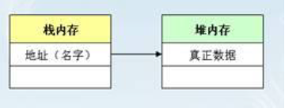

[TOC]


## Java特性

### 面试题

#### 中原银行

1. hashmap的结构，默认扩容因子0.75时，，达到12个元素后什么情况下不会引发扩容？最多能存储多少个元素才引发扩容？
2. 还是hashmap，和currenthashmap区别，二者结构，原理，hashmap能不能存null，为什么可以？
3. threadlocal原理，应用之类的；
4. 

### 封装

Java中的封装是将数据（变量）和作用于数据（方法）的代码作为一个单元一起包装的机制。在封装中，类的变量将从其他类隐藏，并且只能通过其当前类的方法访问。因此，它也被称为数据隐藏。

> 好好理解，好好思考

思考问题：Java 属性为什么要设置为private而不用public

### 多态


### 继承

## JavaWeb

### servlet

1.servletContext生命周期跟web容器生命周期是保持一致的

## 核心知识卷一

1. 一个类的方法操作另一个类的对象，我们就说这个类依赖另一个类


## Mybatis

### 配置的坑

1、如果引用的时mybatis-spring-boot-starter包，MyBatis-Spring-Boot-Starter会做以下操作：

- 自动检测到一个存在的数据源

- 创建并注册一个SqlSessionFactory对象，并将这个数据源传入SqlSessionFactory对象

- 将创建并注册SqlSessionTemplate的实例从SqlSessionFactory中获取的

- Auto-scan your mappers, link them to the `SqlSessionTemplate` and register them to Spring context so they can be injected into your beans

  > ```shell
  > 注意：以上有个前提，是你的Mapper接口跟你的Mapper.xml文件在同一个目录下，如果接口文件和xml是分开放置，比如xml文件在resource目录下，则需要手动配置SqlSessionFactory，并设定好xml扫描路径，此时yml文件中的mybatis.mapper-locations将不会起作用
  > ```

- 手动注入SqlSessionFactoryBean示例

  ```java
      @Bean
      public SqlSessionFactoryBean sqlSessionFactory () throws IOException {
          SqlSessionFactoryBean sqlSessionFactory = new SqlSessionFactoryBean();
          sqlSessionFactory.setDataSource(dataSource);
          /**
           * 如果自定义了SqlSessionFactoryBean，那么配置文件中的mybatis:mapper-locations将不会起作用，需要在此set
           */
          sqlSessionFactory.setMapperLocations(new PathMatchingResourcePatternResolver().getResources(mapperLocations));
          return sqlSessionFactory;
      }
  ```

- mapper.xml文件中jdbcType中必须是大写，无语

  ```xml
  <resultMap id="BasicResultMap" type="cn.qz.mybatis.entity.UserInfoEntity">
      <id column="id" jdbcType="INTEGER" property="id" />
      <result column="name"  jdbcType="VARCHAR" property="name" />
  ```

- 

### 执行日志打印

## 设计模式

### 工厂模式

通俗来讲，就是把需求抽象成一个接口，按照不同的业务需求来实现具体的实现类，然后根据业务类型返回需要的执行对象。Spring的BeanFactory就是标准的工厂模式。

```
思考：工厂模式和代理模式的区别

```

### 代理模式

通俗来讲，就是为其他对象提供一种代理以控制这个对象的访问。

## JVM

### 内存空间理解

#### 堆内存

通俗理解：保存对象的真正数据，都是每一个对象的属性内容
	

#### 栈内存

通俗理解：保存的是一块堆内存的空间地址（类似于地址寄存器）

